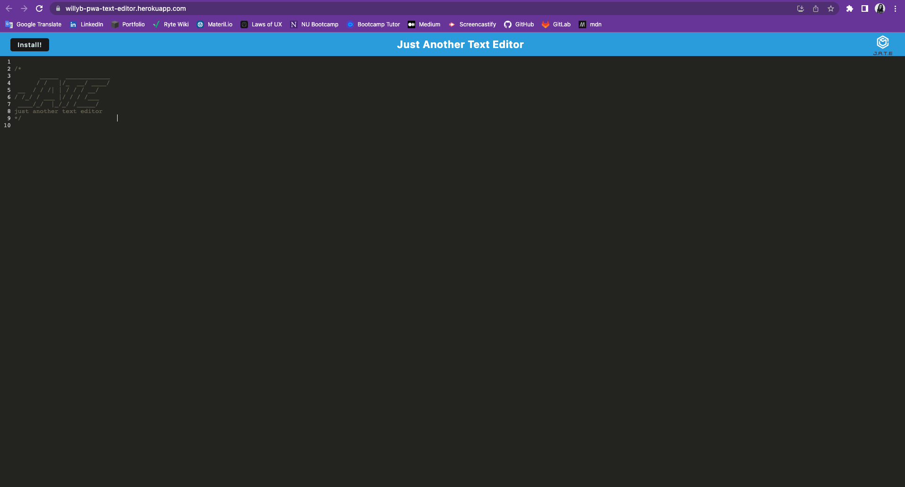

# Willy B's Text Editor PWA

This was my first PWA. I started with an existing application and implemented methods for getting and storing data to an IndexedDB database.

Most of my work revolved around the JavaScript files under the src folder; updating the database and install files to accept some or get all of the data from or to the IndexedDB.

I became more familiar with page inspections, examining "Applications" and the console to check registered service workers and data saved.

Overall, this was a good exploration of a tool brands are using more and more each day.

As specified in the Challenge Acceptance Criteria, the PWA achieves the following:

✨ A client server folder structure appears after opening the application in the editor.

✨ `npm run start` starts up the backend and serves the client.

✨ JavaScript files have been bundled using webpack.

✨ A generated HTML file, service worker and manifest file appear after running webpack plugins.

✨ The text editor still functions in the browser without errors using next-gen JavaScript.

✨ IndexedDB has immediately created a database storage after opening the text editor.

✨ Content in the text editor has been saved with IndexedDB after entering content and subsequently clicking off of the DOM window.

✨ The content in the text editor has been retrieved from our IndexedDB after reopening.

✨ The web application downloads as an icon on desktop after clicking on the Install button.

✨ A registered service worker appears with workbox after loading the web app.

✨ Static assets are pre cached upon loading along with subsequent pages and static assets after registering as a service worker.

✨ Proper build scripts for a webpack application appear after deploying to Heroku.

Below is a screenshot of my latest and greatest:

To take my text editor for a spin, click [here](https://willyb-pwa-text-editor.herokuapp.com/)
